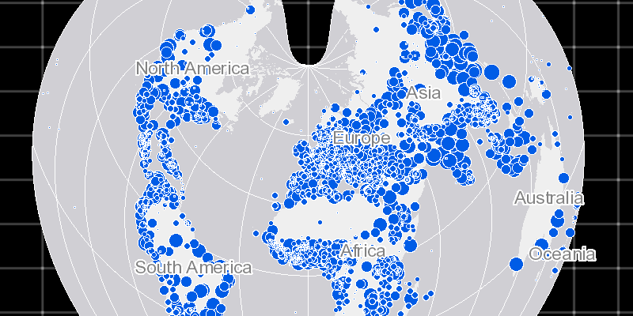

#Map Spatial Reference#
Demonstrates how you can set the spatial reference on a ArcGISMap and all the operational layers will project accordingly.

##How to use the sample##
The `ArcGISMap` is initialized with the spatial reference as world bonne (WKID: 54024) using the SpatialReference initializer. Hence the `ArcGISMapImageLayer` is added, with default spatial reference as GCS_WGS_1984 (WKID: 4326), gets re-projected to map's spatial reference.

##How it works##
To set a `SpatialReference` and project that to all operational layers of `ArcGISMap`:

1. Create an ArcGISMap passing in a spatial reference, `ArcGISMap(SpatialReference.create(54024))`.  
2. Create an `ArcGISMapImageLayer` as a `Basemap`.
3. Set basemap to ArcGISMap.
4. Set ArcGISMap to the `MapView`.
  - the ArcGISMap image layer will now use the spatial reference set to the map and not it's default spatial reference

##Features##
- ArcGISMap
- ArcGISMapImageLayer
- Basemap
- MapView
- SpatialReference
