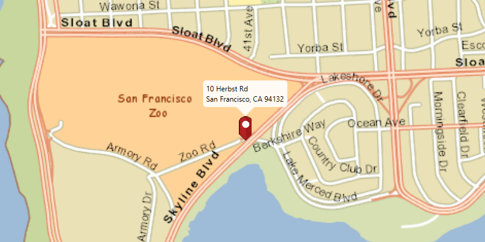

#Find Address#
Demonstrates how to perform geocoding and reverse geocoding with offline data.

##How to use the sample##
For simplicity, the sample comes loaded with a set of addresses. You can select any address to perform geocoding and show it's location on map. To perform reverse geocoding in real-time, click on any location on the ArcGISMap to provide it's address.

##How it works##
 To perform geocoding with offline resources:

1. Create an `ArcGISMap`'s using a `Basemap`.
  - basemap is created using a `TileCache`, which represent our offline resource
2. Add the map to the `MapView`, `MapView.setMap()`. 
3. Create a `LocatorTask` using a URI to the offline locator file and define the `ReverseGeocodeParameters`/`GeocodeParameters` for  the LocatorTask.
4. To geocode an address, set the geocode parameters and use `LocatorTask.geocodeAsync(geocodeParameters)`.
5. To reverse geocode a location, get the `Point` location on the map view and use `LocatorTask.reverseGeocodeAsync(Point)`.
6. Show the retrieved results by creating a `PictureMarkerSymbol` with attributes from the result and add that symbol to a `Graphic`  in the `GraphicsOverlay`.

##Tags
- ArcGISMap
- ArcGISTiledLayer
- Callout
- MapView
- LocatorTask 
- GeocodeParameters
- GeocodeResult
- Graphic
- GraphicsOverlay
- Point
- PictureMarkerSymbol
- ReverseGeocodeParameters
- TileCache
