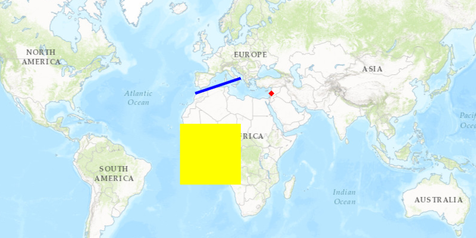

#Add Graphics with Renderer#
Demonstrates how to add Graphics to a GraphicsOverlay and display those Graphics to a MapView using a UniqueValueRenderer. The UniqueValueRenderer uses the attribute value of a Graphic to assign a specific symbol to a specific graphic. 

##How it works##
To add Graphics to a GraphicsOverlay using a UniqueValueRenderer:

1. Create a `GraphicsOverlay` and attach it to the `MapView`.
2. Create a `Graphic` for each bird location.
  - each graphic will have a `Point` with a x,y-coordinate location to display a symbol
  - each graphic will have an attribute with a key SEABIRD and a value of the bird's name
3. Add all graphics to the graphics overlay, `GraphicsOverlay.getGraphics().add(graphic)`.
4. Create an `UniqueValueRenderer`.
  - set field names to SEABIRD `UniqueValRenderer.getFieldNames().add("SEABIRD")`, this will tell the renderer which key to look for in the graphic's attributes
5. Create a `SimpleMarkerSymbol` for each kind of bird.
  - each symbol will have a style, color, and size 
6. Create a `UniqueValue` for each kind of bird.
  - each unqiue value will have a label, description, symbol, and list of objects
  - the list of object will hold the kind of bird to link the symbol to
7. Add unique values to the unique value renderer, `UniqueValRenderer.getUniqueValues().add(unique value)`.
8. Set unique value renderer to graphics overlay, `GraphicsOverlay.setRenderer(unique value renderer)`.

##Features
- ArcGISMap
- Graphic
- GraphicsOverlay
- MapView
- Point
- SimpleMarkerSymbol
- UniqueValue
- UniqueValueRenderer
