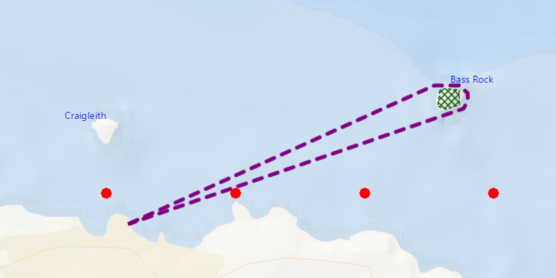

#Add Graphics with Symbols#
Demonstrates how to display a Graphic using a SimpleMarkerSymbol, SimpleLineSymbol, SimpleFillSymbol, and a TextSymbol.

##How it works##
To display a `Graphic` using a symbol:

1. Create a `GraphicsOverlay` and add it to the `MapView`, `MapView.getGraphicsOverlay.add()`.
2. To create a graphic using a `SimpleMarkerSymbol`.
  - create a `Point` where the graphic will be located
  - create a simple marker symbol that will display at that point
  - assign point and symbol to graphic, `Graphic(point, symbol)`
3. To create a graphic using a `SimpleLineSymbol`.
  - create a `PointCollection` that will hold all the points that make up the line
  - create a `Polyline` using the point collection, `Polyline(PointCollection)`
  - create a simple line symbol that will display over those collected points
  - assign polyline and symbol to graphic, `Graphic(polyline, symbol)`
4. To create a graphic using a `SimepleFillSymbol`.
  - create a point collection that will hold all the points that make up the line
  - create a `Polygon` using the point collection, `Polygon(PointCollection)`
  - create a simple line symbol that will display as an outline for points collected
  - create a simeple fill symbol, using line symbol from above, that will fill the region in between the points collected with a single color 
  - assign polygon and symbol to graphic, `Graphic(polygon, symbol)`
5. To create a graphic using a `TextSymbol`.
  - create a point where the graphic will be located
  - create a text symbol, that will display at that point
  - assign point and symbol to graphic, `Graphic(point, symbol)`
6. Add graphic to graphics overlay to display it to the map view.

##Features
- Graphic
- GraphicsOverlay
- MapView
- Point
- PointCollection
- Polygon
- Polyline
- SimepleFillSymbol
- SimpleLineSymbol
- SimpleMarkerSymbol
- TextSymbol
