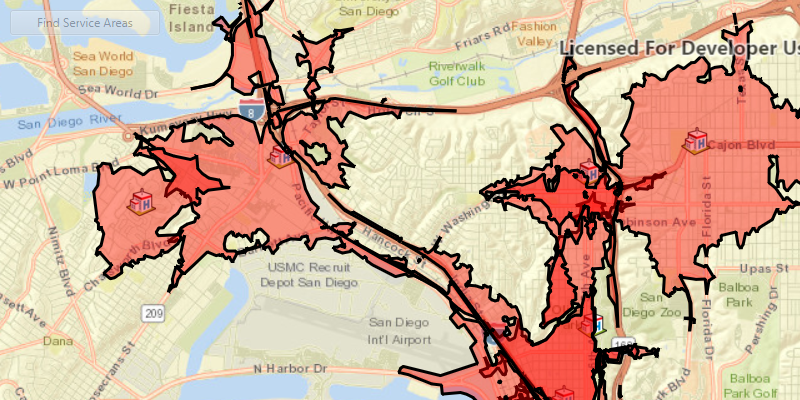

# Find service areas for multiple facilities

Find the service areas of several facilities from a feature service.

## Use case

A service area shows locations that can be reached from a facility based off a certain impedance, such as travel time or distance. When analyzing the service area of several facilities, this workflow can assist in finding gaps in service area coverage, or significant overlaps, helping to optimize the distribution of facilities. For example, a city's health service may identify areas of a city that can be effectively accessed from particular hospitals, and with this optimize distribution of staff and resources.

## How to use the sample

Click the 'find service areas' button to determine and display the service area of each facility on the map. The polygons displayed around each facility represent the service area, with colours representing a cutoff for impedance (in this case, travel time).

## How it works

1. Create a new `ServiceAreaTask` from a network service.
1. Create default `ServiceAreaParameters` from the service area task.
1. Set the parameters `ServiceAreaParameters.setReturnPolygons(true)` to return polygons of all service areas.
1. Add facilities of the `ServiceAreaParameters`. For this, use a set of `QueryParameters` to select features from an `ArcGISFeatureTable`: `serviceAreaParameters.setFacilities(facilitiesArcGISFeatureTable, queryParameters)`.
1. Get the `ServiceAreaResult` by solving the service area task using the parameters.
1. For each facility, get any `ServiceAreaPolygons` that were returned, `serviceAreaResult.getResultPolygons(facilityIndex)`.
1. Display the service area polygons as `Graphics` in a `GraphicsOverlay` on the `MapView`.

## About the data

This sample uses a street map of San Diego, in combination with a Feature Server of facilities which are used here to represent hospitals.

## Relevant API

* ServiceAreaFacility
* ServiceAreaParameters
* ServiceAreaPolygon
* ServiceAreaResult
* ServiceAreaTask

## Tags

facilities, impedance, network analysis, service area, travel time
